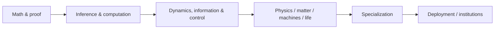

# Program map

The curriculum is one recommended route through a larger reference map.

| Layer | Weeks | Contents | Exit |
|---|---:|---|---|
| Foundations I | 48 | Math, inference, computation, optimization, control, measurement | Model and test unfamiliar systems |
| Foundations II | 52 | Physics, matter, machines, biology, manufacturing, safety | Connect models to physical / biological reality |
| Specialization | 24 | Choose one of 7 tracks | Reproduce and extend frontier work |
| Human systems & deployment | 12 | History, power, economics, institutions, standards, communication | Orient and govern technical action |

[Premise ->](premise.md) | [Dependency map ->](dependency-map.md) | [22-module map ->](../02-core/README.md)

## Read it as a graph, not a calendar

The schedule is useful for sequencing. The underlying object is the prerequisite graph.
