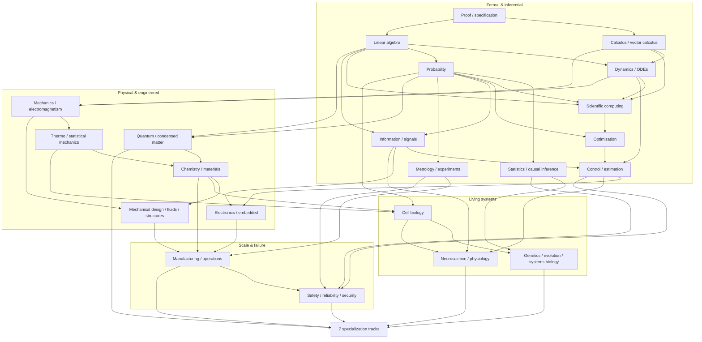

# Dependency / field map

Edges mean **usually useful before**, not "finish every page first."

## Use

- **Forage:** enter at the nearest concept you do not own.
- **Sequence:** follow upstream arrows when a later topic feels like notation without intuition.
- **Contribute:** curriculum reordering should explain which dependencies have become cheaper, unnecessary, or teachable in parallel.
