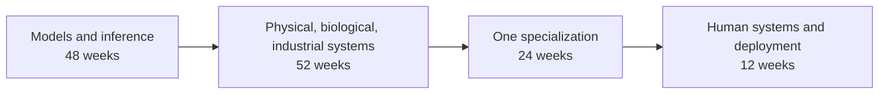

---
hide:
  - navigation
  - toc
---

# Open Frontier Curriculum

Foundations, frontier technologies, and human judgment for the 21st century.

**Hypothesis:** AI can reduce the time and labor needed to attempt some technical work. The effect is uneven. Foundational models, experiments, domain expertise, and human judgment still limit results.

## Orientation

-   **What can I know?**

    Mathematics, probability, computation, physics, biology, measurement.

    [Foundations](02-core/README.md)

-   **What should I do?**

    Experiments, engineering, control, manufacturing, safety, proof of work.

    [Practice](06-proof-of-work/README.md)

-   **What may I hope?**

    Deployed systems, active research, large engineering projects, and open technical problems.

    [Frontier 100](05-frontier/README.md)

-   **What is the human being?**

    Physiology, mind, history, power, institutions, economics, communication.

    [Human systems](04-integration/README.md)

## Contents

<b>22</b>foundation modules

<b>7</b>specialization tracks

<b>100</b>frontier targets

<b>130</b>curated textbooks

## Curriculum route

The week counts are a reference schedule. Each module has an exit capability, readings, reconstruction tasks, practical work, and a mastery gate.

-   **[Ordered curriculum](00-start-here/README.md)**

    Begin at Week 1. Advance after each mastery gate.

-   **[Technology route](05-frontier/README.md)**

    Start with a target. Trace its bottleneck and prerequisites.

-   **[Subject route](07-resources/README.md)**

    Use the maps and resource pages as a reference shelf.

<small>The four orientation questions adapt a familiar Kantian set of questions. The labels organize the site; they do not imply one philosophical doctrine. See the [Stanford Encyclopedia of Philosophy](https://plato.stanford.edu/entries/kant-reason/).</small>
